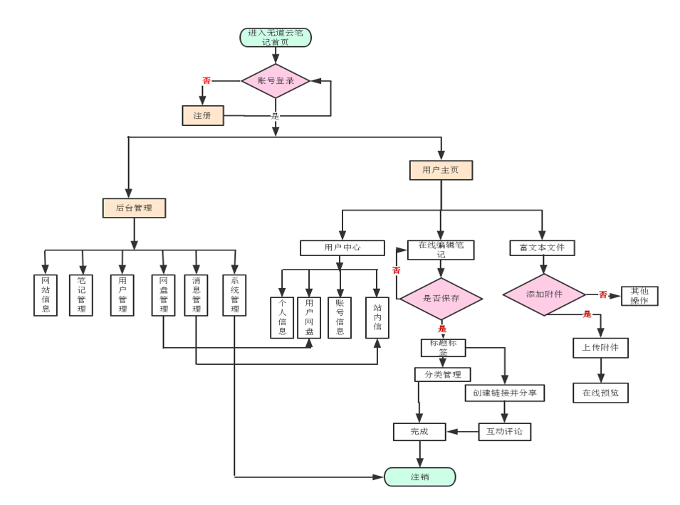
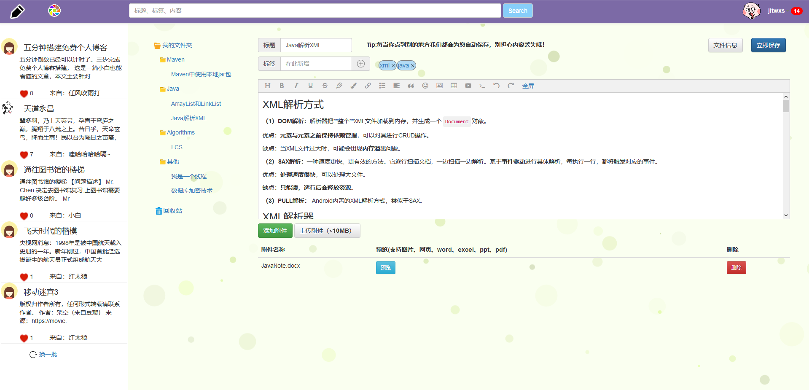
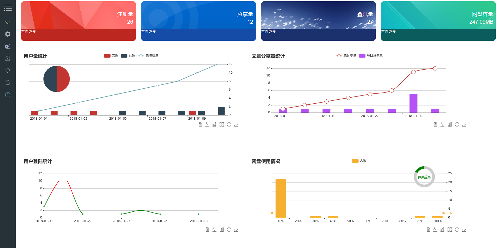
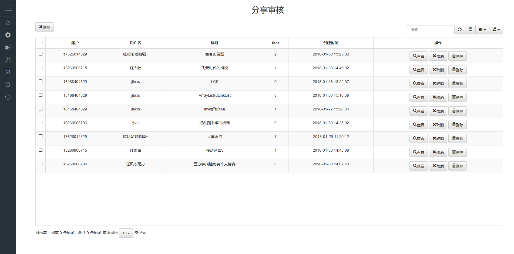
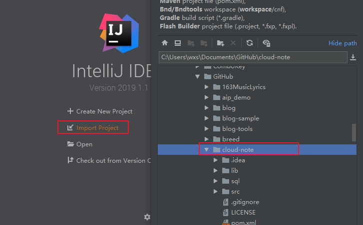
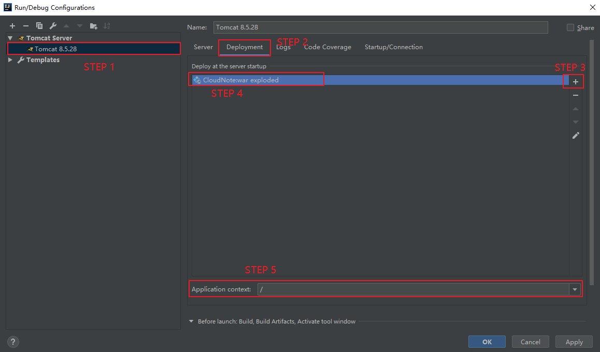
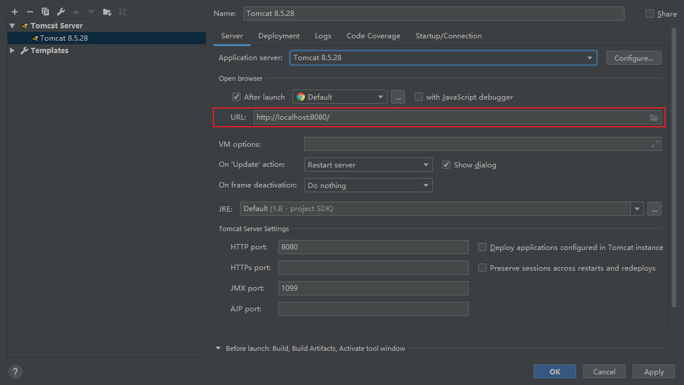
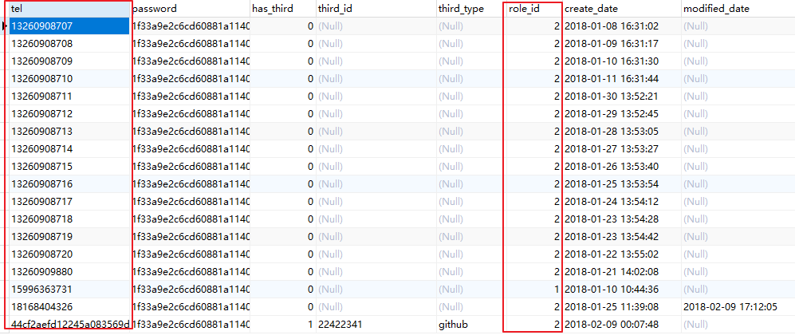

## 无道云笔记

### 一、使用技术

- 前端：Bootstrap

- 开发工具；IDEA

- 数据库：MySQL

- 数据可视化：Echarts

- 后端框架：Spring + SpringMVC + Mybatis

- 安全框架：Shiro

- PDF转换：Aspose

- PDF预览：PDF.js

- 全局搜索：Lucene

- 短信服务：阿里云

- 评论：Valine

- 社会化分享：Jiathis

### 二、项目截图

**整体流程图 ：**



**用户首页：**



**笔记搜索：**


**笔记分享：**


**消息中心：**


**个人网盘：**


**管理员首页：**



**分享审核：**



### 三、起步

> 阿里云短信服务请自行注册，然后编辑 `system.properties` 文件的 `MOULD_ID` 、`ACCESS_KEY_ID` 和 `ACCESS_KEY_SECRET` 属性。

#### 3.1 配置数据库

（1）首先请创建数据库：

```sql
CREATE DATABASE IF NOT EXISTS `cloud_note` /*!40100 DEFAULT CHARACTER SET utf8 */
```

（2）导入项目 sql 文件夹下的 `cloud_note.sql` 文件。

（3）编辑项目中 `src/main/resources/db.properties` 文件，修改数据库连接信息：

```application
jdbc.driver=com.mysql.jdbc.Driver
jdbc.url=jdbc:mysql://localhost:3306/cloud_note?useUnicode=true&characterEncoding=utf-8
jdbc.username=root # 用户名
jdbc.password=root # 密码
```

#### 3.2 运行程序

电脑安装 IDEA Ultimate 版，并安装好 `Tomcat`、`Maven`（可略，使用IDEA自带也行）后。

（1）运行 IDEA，点击 `Import Project` 按钮，导入项目。



（2）点击 `File -> Settings -> Build,Execution... -> Application Servers` 中添加 Tomcat 的路径。

添加完毕后，点击主窗口中 `Add Configuation...`，添加 Tomcat 启动项，如图所示。


（3）添加完毕后，添加项目到 Tomcat 中，如图所示。



（5）确保 URL 正确，如图所示



（6）配置完毕后，依次点击 `Apply`、`OK` 按钮，然后点击 `Tomcat` 旁边的绿色三角按钮即可。


#### 3.3 用户登录

查看 `login` 表记录，登录名为 `tel` 列记录，密码均为 `123`。用户角色为 `role_id` 列，请自行更改：

- role_id = 1：管理员
- role_id = 2：普通用户



### 四、任务要求

#### 任务一 题目理解

- 根据题目要求，以流程图等形式展示总体业务逻辑，并给出系统E-R图

- 进行技术选型，给出相关技术

#### 任务二 后端通信协议确立和接口文档编写

确立前后端通信协议，编写前后端通信接口文档

#### 任务三 用户登陆、注册功能实现

- 使用手机号码和第三方应用登陆、注册（注册信息包括头像、昵称、邮箱、性别、地区等）

- 用户访问资源的认证和授权

#### 任务四 云笔记的创建和在线编辑

- 登陆后可在线创建和修改笔记

- 笔记包括标签、标题、内容、附件等基本属性，笔记编辑区域具备基本的富文本编辑功能

- 笔记具有修改和删除功能

- 笔记编辑完成后，可以手动同步笔记，或者跳转到其他界面时自动同步笔记

#### 任务五 笔记分类和搜索功能实现

- 笔记编辑完成后，对笔记进行分类归档

- 笔记文件夹可以进行创建、重命名和删除功能

- 对笔记标题、标签和内容进行索引，实现快速查找

#### 任务六 笔记分享功能实现

默认拥有者才有查看和编辑权限，共享笔记时，可以将笔记链接分享到微信、QQ、微博、好友

#### 任务七 创建富文本文件笔记

- 通过上传word、execel、ppt、pdf等富文本文件，创建富文本笔记

- 要求在线预览

#### 附加任务

- 消息推送

- 后台管理（用户、笔记、消息、网盘）

- 笔记评论

- 个人网盘

- 数据可视化

- 逛一逛（站内查看分享）